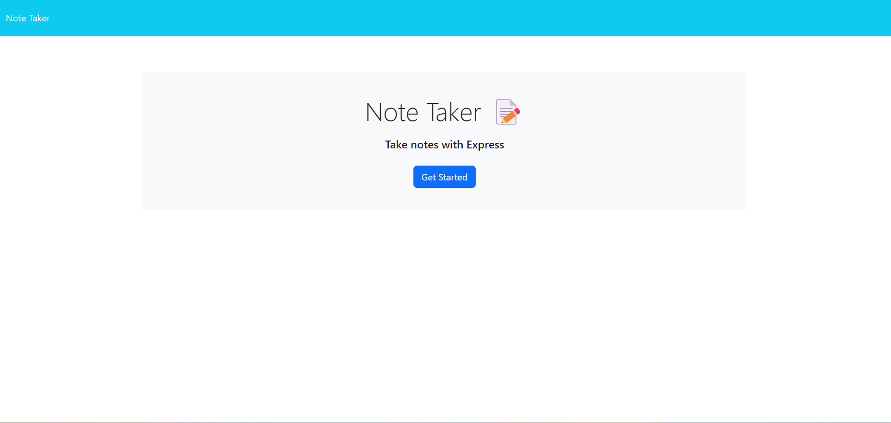
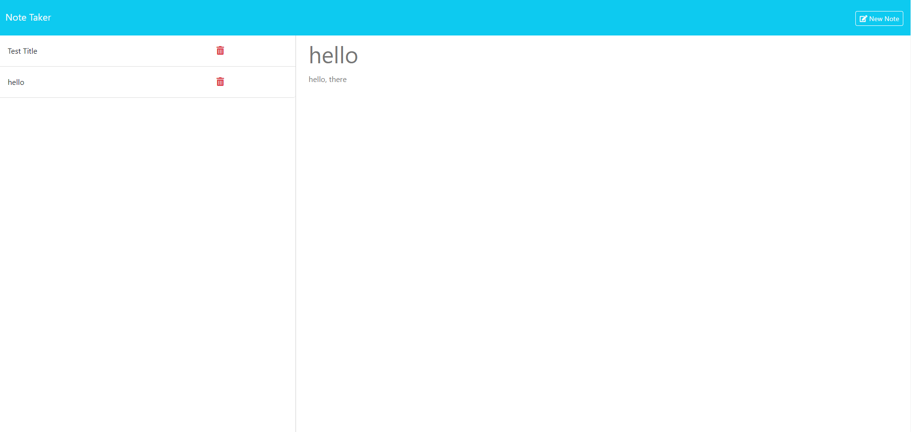

# Note Taker
  

## Description

This is an app, called Note Taker,  that allows users to write, save and delete notes. 

## Table of Contents

- [Installation](#installation)
- [Usage](#usage)
- [Contributing](#contributing)
- [Tests](#tests)
- [License](#license)
- [Questions](#questions)
- [Demo](#demo)
- [Links](#url)

## License

This project is licensed under the MIT License. Click the badge above for more details.

For the full text of the license, see [MIT](LICENSE).

## Installation
To run this application, follow these steps:

1. Install NODE.js to run this application
2. Create a .gitignore file and include node_modules/ to prevent the node_modules directory from being tracked or uploaded to GitHub.
3. Make sure your repository includes a package.json file with the required dependencies. You can create one by running npm init when setting up the project.
4. Install the inquirer@8.2.4 package dependency by running npm i inquirer@8.2.4 in the integrated terminal.
5. Install the Express package by running npm i express.
6. Install the UUID package to generate unique IDs by running npm i uuid.
7. Start the application by running node server.js. This will start a localhost server on PORT 3001.
8. Open your browser and navigate to http://localhost:3001/ to access the application locally.

## Usage
Follow these steps to use the Note Taker application:

1.Open the deployed Note Taker application to access the landing page with links to a note page.

2.Click the "Get Started" button to navigate to a page displaying existing notes in the left-hand column, along with empty fields to enter a new note title and text in the right-hand column.

3.Enter a new note title and text. A Save icon will appear in the navigation bar at the top of the page.

4.Click the Save icon to save the new note, which will then appear in the left-hand column with other existing notes.

5.Click on an existing note in the left-hand column to view it in the right-hand column.

6.To delete a note, click the delete button next to the note in the list on the left-hand side.

7.Click the Write icon in the navigation bar to enter a new note title and text in the right-hand column.

## License

This project is licensed under the MIT License. Click the badge above for more details.

For the full text of the license, see [MIT](LICENSE).

## Questions

For questions about the project, please contact [email](mailto:andrewcasablanca@yahoo.com).

GitHub: [ajcasablanca](https://github.com/ajcasablanca)

## Demo

## Live links
1.[Heroku link](https://notetaker1994-app-8dc014166e12.herokuapp.com/)

2.[GitHub Repository](https://github.com/ajcasablanca/Note-Taker)

3.[Live Demo](https://drive.google.com/file/d/16n2UoBY5qrx9TjEEALeBLhHDTSTzKaC0/view?usp=sharing)
